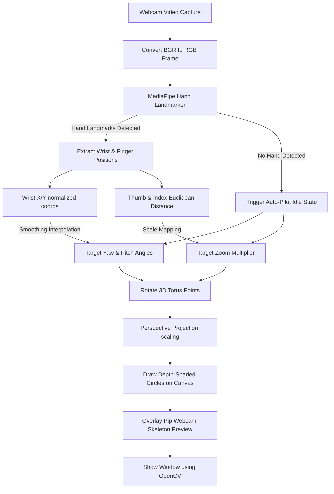

# 🖐️ Hand Gesture 3D Object Controller

An interactive Python application that lets you control a 3D particle torus in real-time using your webcam and hand gestures. Powered by **MediaPipe Hand Landmarker** and **OpenCV**, this project demonstrates real-time computer vision, hand tracking, and 3D projection rendering.

---

## 🌟 Features

*   **Real-time Hand Tracking**: Uses Google's MediaPipe Hand Landmarker to track 21 3D hand joints at high framerates.
*   **3D Particle Torus Rendering**: Renders a complex 3D torus made of particles projected onto a 2D canvas with depth shading (particles get brighter as they move closer to the camera).
*   **Intuitive Gesture Controls**:
    *   **Rotation**: Move your hand left/right (yaw) and up/down (pitch) relative to the screen to rotate the torus in 3D space.
    *   **Pinch-to-Zoom**: Pinch your thumb and index finger together to zoom out, and spread them apart to zoom in.
*   **Auto-pilot Mode**: When no hand is detected, the torus automatically enters a smooth auto-rotation mode and resets to the default zoom level.
*   **Picture-in-Picture Webcam Preview**: Displays a live, annotated webcam feed in the top-right corner showing your hand's skeleton and the active thumb-to-index pinch indicator.
*   **Keyboard fallbacks**: Manually adjust zoom using `+` / `-` keys.

---

## 📊 Pipeline & Architecture

Below is the workflow of the hand-tracking and rendering pipeline:



---

## 🛠️ Tech Stack & Dependencies

*   **Python 3.10+**
*   **OpenCV (`opencv-python`)**: For video capture, canvas drawing, and rendering.
*   **MediaPipe**: For high-fidelity, low-latency hand landmark tracking.
*   **NumPy**: For fast 3D coordinate transformations, matrix multiplications (rotations), and calculations.

---

## 🚀 Getting Started

### Prerequisites

Ensure you have Python 3.10 or newer installed. You will also need a working webcam.

### Installation

1. Clone the repository:
   ```bash
   git clone https://github.com/siddarthareddy1931-star/Hand-Gesture.git
   cd Hand-Gesture
   ```

2. Install the required dependencies:
   ```bash
   pip install -r requirements.txt
   ```

3. Run the application:
   ```bash
   python hand_gesture_3d.py
   ```

> **Note**: On the first run, the script will automatically download the lightweight `hand_landmarker.task` model file (~3.9 MB) from Google's servers.

---

## 🎮 How to Control

| Action | Gesture / Key | Description |
| :--- | :--- | :--- |
| **Rotate Horizontally** | Move hand Left / Right | Rotates the torus along the Y-axis. |
| **Rotate Vertically** | Move hand Up / Down | Rotates the torus along the X-axis. |
| **Zoom In** | Spread thumb and index finger | Increases the scale of the torus particles. |
| **Zoom Out** | Pinch thumb and index together | Decreases the scale of the torus particles. |
| **Manual Zoom In** | Press `+` or `=` | Zoom in manually using the keyboard. |
| **Manual Zoom Out** | Press `-` or `_` | Zoom out manually using the keyboard. |
| **Quit** | Press `Q` | Safely closes the application windows and releases the camera. |

---

## 🔍 How it Works

1. **Webcam Feed Acquisition**: OpenCV captures frames from the default camera.
2. **Hand Tracking**: Each frame is sent to MediaPipe's Hand Landmarker task running in `VIDEO` mode for temporal consistency.
3. **Control Mapping**:
    *   The wrist landmark ($x, y$) coordinates are normalized relative to the screen center ($0.5, 0.5$) and mapped to target rotation angles.
    *   The Euclidean distance between the thumb tip (landmark 4) and index finger tip (landmark 8) is calculated and mapped to a scale multiplier (zoom).
4. **3D Projection & Rendering**:
    *   A set of 1,200 particle coordinates ($x, y, z$) is generated mathematically in the shape of a torus.
    *   These coordinates are multiplied by rotation matrices (pitch and yaw) and scaled by the zoom level.
    *   The 3D coordinates are projected into 2D screen space using a perspective projection formula:
        $$\text{scale} = \frac{\text{FOV}}{z + \text{depth}}$$
    *   OpenCV draws circles for each particle with sizes and brightness levels scaled dynamically by their depth ($z$) coordinate to create a realistic 3D depth cue.

---

## 🔧 Troubleshooting & Common Issues

### 1. Web Camera Access/Permission Issues
If the app starts but crashes immediately with camera read errors, make sure:
* Your camera is connected and not being used by another application (e.g., Zoom, Teams, Discord).
* On Windows, check **Settings > Privacy & Security > Camera** and ensure access is toggled on for desktop apps.

### 2. Dependency Conflicts (Protobuf / TensorFlow)
If you encounter `ImportError: cannot import name 'runtime_version' from 'google.protobuf'` or other conflicts:
* This project specifies a highly compatible version of Protobuf (`protobuf>=5.26.1,<6.0.0dev`). Clean up old packages and reinstall:
  ```bash
  pip uninstall -y protobuf mediapipe
  pip install -r requirements.txt
  ```
